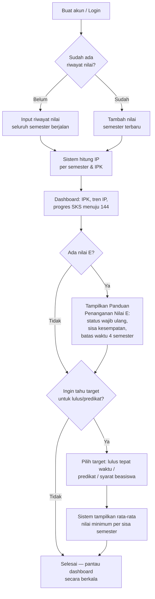

# Product Requirements Document (PRD)
## IPKu — Pelacak Akademik & Perencana Kelulusan Mahasiswa IPB

| | |
|---|---|
| **Produk** | IPKu |
| **Versi Dokumen** | 2.0 (Draft) |
| **Tanggal** | 25 September 2026 |
| **Status** | Draft untuk direview |
| **Pemilik Produk** | *TBD* |
| **Platform** | Aplikasi web (responsive, mobile-first) |
| **Riwayat Revisi** | v1.0 — fokus kalkulator per semester. v2.0 — reposisi produk menjadi pelacak riwayat akademik penuh + dashboard + perencana kelulusan (lihat Bagian 2.4). |

---

## 1. Ringkasan Eksekutif

IPKu adalah aplikasi web tempat mahasiswa **Sarjana Institut Pertanian Bogor (IPB)** mencatat **seluruh riwayat nilai mata kuliah** yang pernah ditempuh, lalu mendapatkan **dashboard pribadi** (setelah login) yang menampilkan IP per semester, IPK berjalan, dan progres SKS menuju syarat kelulusan. Dari data tersebut, sistem memberikan **rekomendasi konkret**: apa yang harus dicapai mahasiswa agar bisa lulus (sisa SKS, target nilai), dan bila mahasiswa memiliki nilai **E** pada suatu mata kuliah, sistem memandu langkah yang harus diambil (aturan pengulangan mata kuliah) agar tetap bisa lulus sesuai **Panduan/Peraturan Akademik Multistrata IPB yang berlaku**.

Berbeda dari kalkulator IP semester sederhana yang sudah tersedia di **IPB Mobile**, nilai jual utama IPKu adalah: **riwayat akademik yang tersimpan dan terakumulasi dari waktu ke waktu**, **visibilitas progres menuju kelulusan (bukan cuma satu semester)**, dan **panduan aksi** (bukan cuma angka) — termasuk penanganan kasus berisiko seperti nilai E.

---

## 2. Latar Belakang & Masalah

### 2.1 Konteks
Setiap semester, mahasiswa IPB menerima nilai huruf mutu (A, AB, B, BC, C, D, E) per mata kuliah. IP dan IPK dihitung dari akumulasi angka mutu dikalikan bobot SKS. IPB Mobile sudah menyediakan kalkulator dasar untuk menghitung IP satu semester, namun tidak menyediakan gambaran akumulatif jangka panjang maupun panduan tindak lanjut.

### 2.2 Masalah yang Diselesaikan
1. **Tidak ada gambaran akumulatif yang mudah diakses** — mahasiswa sulit melihat *tren* IP dari semester ke semester dan progres riil menuju syarat kelulusan (144 SKS) dalam satu tempat.
2. **Sulit merencanakan sisa masa studi** — mahasiswa kesulitan menjawab *"SKS saya kurang berapa lagi? Nilai rata-rata berapa yang harus saya kejar di sisa semester supaya bisa lulus / lulus dengan IPK tertentu?"*
3. **Kebingungan saat mendapat nilai E** — mahasiswa yang mendapat huruf mutu E sering tidak tahu persis langkah yang harus diambil (wajib mengulang, batas jumlah pengulangan, batas waktu pengulangan, konsekuensi bila gagal) sehingga berisiko salah langkah dan terancam putus studi (drop-out).
4. **Alat yang sudah ada (IPB Mobile) bersifat kalkulator sesaat** — hanya menghitung IP untuk input yang dimasukkan saat itu, tidak menyimpan riwayat lintas semester maupun memberi rekomendasi/peringatan proaktif.
5. **Aturan akademik tersebar dan sulit dipahami** — Peraturan Akademik/Panduan Multistrata IPB adalah dokumen formal yang panjang dan jarang dibaca utuh oleh mahasiswa, terutama pasal-pasal teknis seperti aturan perkuliahan ulang untuk nilai D/E.

### 2.3 Dampak Bila Tidak Diselesaikan
Mahasiswa membuat keputusan akademik (mengambil semester pendek, memilih jumlah SKS, menentukan prioritas mengulang mata kuliah) berdasarkan estimasi kasar atau bahkan tidak menyadari tenggat waktu penting (mis. batas 4 semester untuk mengulang nilai E), sehingga berisiko terlambat lulus atau bahkan di-drop-out.

### 2.4 Perubahan Arah Produk dari Draft Sebelumnya
Draft PRD v1.0 berfokus pada "kalkulator IP semester" sebagai fitur inti. Setelah masukan lebih lanjut, arah produk direvisi karena fungsi tersebut **sudah tersedia di IPB Mobile**. IPKu v2.0 bergeser menjadi produk **riwayat akademik + dashboard + perencana kelulusan**, dengan kalkulator semester hanya sebagai salah satu bagian input data, bukan fitur utama yang dijual.

---

## 3. Tujuan & Sasaran

### 3.1 Tujuan Produk
- Menjadi **satu tempat terpusat** bagi mahasiswa untuk mencatat seluruh riwayat nilai mata kuliah dan melihat perkembangan IP/IPK dari waktu ke waktu.
- Memberikan **rekomendasi aksi yang jelas** tentang apa yang perlu dicapai mahasiswa untuk lulus (SKS tersisa, target nilai) — bukan sekadar angka IPK.
- Memberikan **panduan khusus** bagi mahasiswa dengan nilai bermasalah (D/E) agar memahami langkah wajib sesuai aturan resmi IPB dan tidak terlambat bertindak.
- Menjadi rujukan cepat aturan akademik (syarat kelulusan, aturan perkuliahan ulang) yang selalu sinkron dengan peraturan resmi terbaru.

### 3.2 Sasaran Terukur (Objectives)
| Sasaran | Indikator |
|---|---|
| Akurasi perhitungan & rekomendasi | 0% selisih dibanding perhitungan manual sesuai peraturan akademik IPB yang berlaku (diverifikasi tim akademik/QA) |
| Kelengkapan data pengguna | Rata-rata jumlah semester riwayat yang diinput per pengguna aktif |
| Adopsi | Jumlah mahasiswa aktif bulanan (MAU) pada semester pertama peluncuran |
| Retensi | % pengguna yang kembali login setiap kali nilai baru keluar (per semester) |
| Efektivitas peringatan | % pengguna dengan nilai E yang membuka & menindaklanjuti panduan pengulangan mata kuliah |
| Kepuasan | Skor kepuasan pengguna (CSAT/NPS) dari survei in-app |

### 3.3 Non-Tujuan (Out of Scope untuk versi ini)
- Tidak menggantikan Sistem Informasi Akademik resmi IPB (SIMAK/KRS/IPB Mobile) — IPKu bersifat alat bantu pelacakan & simulasi mandiri, bukan sumber data nilai resmi.
- Tidak menangani jenjang Pascasarjana (Magister/Doktor) atau Sarjana Terapan pada rilis awal — fokus khusus **Sarjana**.
- Tidak terintegrasi otomatis (scraping/API resmi) dengan sistem akademik IPB pada versi awal; input nilai dilakukan manual oleh pengguna (impor semi-otomatis dari file masuk fase 2).
- Tidak menggantikan peran Dosen Pembimbing Akademik (PA) — rekomendasi bersifat estimasi, keputusan akhir tetap melalui jalur akademik resmi.

---

## 4. Target Pengguna

### 4.1 Persona Utama
1. **Mahasiswa Pemantau Progres** — Ingin tahu, dari semester ke semester, apakah dia "on track" menuju kelulusan (SKS terkumpul vs 144 SKS, tren IP naik/turun).
2. **Mahasiswa Pemburu Cumlaude / Penerima Beasiswa** — Ingin tahu nilai minimum yang harus dicapai tiap semester tersisa agar target IPK/predikat tertentu tercapai.
3. **Mahasiswa dengan Nilai Bermasalah (D/E)** — Baru saja mendapat nilai E (atau D) pada suatu mata kuliah, panik/bingung soal langkah yang wajib diambil, dan butuh panduan jelas berbasis aturan resmi agar tidak terlambat mengulang dan berisiko drop-out.
4. **Mahasiswa Menjelang Akhir Studi** — Fokus memastikan seluruh syarat kelulusan (144 SKS, IPK ≥ 2,00, tidak ada nilai E tersisa, dsb.) sudah terpenuhi sebelum mengajukan sidang/yudisium.

### 4.2 Karakteristik Pengguna
- Mayoritas mengakses dari perangkat mobile di sela waktu kuliah, terutama saat pengumuman nilai dan periode pengisian KRS.
- Sudah familiar dengan IPB Mobile untuk kalkulasi cepat, tetapi tidak punya tempat untuk melihat *riwayat & tren* jangka panjang.
- Menginginkan kejelasan aksi: bukan cuma "IPK kamu 3,2", tapi "kamu perlu ambil X SKS lagi dengan rata-rata nilai Y agar lulus tepat waktu."

---

## 5. Aturan Bisnis (Berdasarkan Peraturan/Panduan Akademik Multistrata IPB)

> **Catatan untuk tim pengembang:** Aturan di bawah bersumber dari **Peraturan Rektor IPB Nomor 25 Tahun 2023** (Perubahan atas Peraturan Rektor IPB Nomor 24 Tahun 2023 tentang Tata Tertib Penyelenggaraan Program Diploma Tiga, Sarjana Terapan, Sarjana, Magister, Doktor, dan Profesi IPB). Karena peraturan ini dapat direvisi, seluruh angka **wajib disimpan sebagai data konfigurasi bertanggal versi** (rule engine), bukan hard-coded, dan divalidasi ulang oleh tim akademik sebelum setiap rilis.

### 5.1 Konversi Huruf Mutu → Angka Mutu (AM)

| Huruf Mutu | Rentang Nilai Akhir | Angka Mutu (AM) | Keterangan |
|---|---|---|---|
| A | ≥ 80 | 4,0 | Istimewa |
| AB | 75 – < 80 | 3,5 | Sangat Baik |
| B | 70 – < 75 | 3,0 | Baik |
| BC | 65 – < 70 | 2,5 | Cukup Baik |
| C | 55 – < 65 | 2,0 | Cukup |
| D | 45 – < 55 | 1,0 | Kurang |
| E | < 45 | 0,0 | Tidak Lulus |
| BL | — | — | Belum Lengkap (dikecualikan dari perhitungan sampai nilai final terisi) |

*Rumus:*
`IP Semester = Σ(AM MK × SKS MK) / Σ(SKS MK yang diambil semester tsb)`
`IPK = Σ(AM seluruh MK yang diperhitungkan × SKS) / Σ(total SKS kumulatif yang diperhitungkan)`

### 5.2 Syarat Kelulusan Program Sarjana (Tabel T.1 Peraturan Rektor IPB No. 25/2023)

| Kriteria | Ketentuan untuk Program Sarjana |
|---|---|
| IPK minimum | ≥ 2,00 |
| Beban studi (total SKS) | ≥ **144 SKS** |
| Nilai E | **Tidak boleh ada** nilai E yang tersisa di transkrip akhir |
| Mata kuliah wajib | Seluruh mata kuliah yang diprogramkan harus telah diselesaikan |
| Syarat bahasa | Skor TOEFL-like minimal 477 / IELTS-like minimal 5,5 / Duolingo minimal 80 |
| Tugas akhir | Skripsi/Tugas Akhir harus telah diselesaikan |
| Administrasi | Memenuhi seluruh persyaratan akademik & administrasi lain yang berlaku |

Ini adalah **target akhir** yang dipakai sistem sebagai acuan progres kelulusan (mis. progress bar "112 dari 144 SKS", checklist "masih ada 1 nilai E yang wajib diselesaikan", dst).

### 5.3 Aturan Perkuliahan Ulang untuk Mahasiswa Sarjana (khusus nilai D & E)

Ini menjadi dasar utama fitur **Panduan Penanganan Nilai E** (lihat Bagian 6.1, F-E1–F-E4):

1. Mahasiswa yang mendapat huruf mutu **E** **wajib mengulang** mata kuliah tersebut (kecuali mata kuliah kelompok EC/Enrichment Courses, yang bisa dibatalkan dengan persetujuan Dosen Pembimbing dan departemen terkait).
2. Pengulangan untuk nilai E dapat dilakukan **maksimal 2 (dua) kali** selama masa perkuliahan.
3. Jika setelah 2 kali pengulangan mahasiswa **masih** mendapat huruf mutu E, mahasiswa **tidak dapat registrasi ulang** pada semester berikutnya dan **dikeluarkan dari IPB**.
4. Nilai **D** boleh diulang (opsional) dengan persetujuan dosen penanggung jawab mata kuliah; mata kuliah yang sudah dinyatakan lulus (C ke atas) **tidak dapat** diulang.
5. Mata kuliah kelompok **CCC** yang bernilai E **wajib** diulang pada masa perkuliahan berikutnya (tidak bisa ditunda).
6. **Batas waktu kritis:** jarak antara semester pengambilan awal dan pengambilan ulang pertama untuk nilai E **tidak boleh lebih dari 4 (empat) semester**. Jika mahasiswa belum mengulang setelah 4 semester berlalu, mahasiswa **dinyatakan keluar dari IPB**.
7. Nilai yang diperhitungkan dalam IPK setelah pengulangan adalah **nilai terbaik** dari seluruh percobaan.

> Implikasi produk: setiap kali pengguna mencatat nilai **E** pada suatu mata kuliah, sistem harus otomatis: (a) menandai mata kuliah tersebut berstatus "wajib diulang", (b) menghitung mundur batas waktu 4 semester sejak pengambilan awal, (c) melacak sudah berapa kali diulang (maks. 2 kali), dan (d) menampilkan peringatan tegas bila mendekati/melewati batas — karena konsekuensinya adalah **dikeluarkan dari IPB**, bukan sekadar nilai jelek.

### 5.4 Predikat Kelulusan (Parameterized — perlu verifikasi lanjutan)
Sistem harus tetap mendukung minimal 3 tingkat predikat kelulusan (Memuaskan, Sangat Memuaskan, Dengan Pujian/Cumlaude), masing-masing dengan ambang IPK dan syarat masa studi tertentu. **Angka ambang batas pastinya belum terverifikasi penuh dalam riset ini** dan wajib dikonfirmasi terhadap edisi Peraturan Akademik IPB terbaru sebelum dikunci sebagai default sistem (lihat Bagian 14, Open Questions).

### 5.5 Prinsip Desain Rule Engine
- Seluruh konstanta (5.1–5.4) disimpan sebagai data konfigurasi bertanggal versi ("berlaku sejak Peraturan Rektor No. X Tahun Y"), agar mahasiswa angkatan lama tetap dihitung dengan aturan yang berlaku pada masanya bila diperlukan.
- Perubahan aturan oleh admin melalui proses approval dan tercatat di log audit.

---

## 6. Ruang Lingkup Fitur

### 6.1 MVP (Prioritas Tinggi — Must Have)

| # | Fitur | Deskripsi |
|---|---|---|
| F1 | **Akun & Login** | Mahasiswa membuat akun (email) agar data riwayat akademiknya tersimpan permanen dan bisa diakses lintas perangkat. |
| F2 | **Input Riwayat Nilai Lengkap** | Form untuk mencatat **seluruh** mata kuliah yang pernah/sedang ditempuh: semester, nama MK, SKS, huruf mutu. Mendukung input bertahap (menambah semester baru tiap kali nilai keluar) maupun input massal riwayat lama sekaligus. |
| F3 | **Dashboard IP & IPK** | Setelah login, tampilan utama menampilkan: IPK berjalan, grafik/tren IP per semester, total SKS lulus, dan progres menuju 144 SKS. |
| F4 | **Progress Menuju Kelulusan** | Ringkasan status terhadap seluruh syarat kelulusan Sarjana (Bagian 5.2): SKS terkumpul vs 144, status ada/tidaknya nilai E tersisa, IPK vs syarat minimum 2,00. |
| F5 | **Rekomendasi Rencana Studi ("Apa yang Harus Dicapai")** | Berdasarkan sisa SKS menuju 144 dan target IPK yang dipilih pengguna, sistem menghitung **rata-rata nilai/IP minimum** yang harus dicapai pada sisa semester agar target tercapai. |
| F6 | **Panduan Penanganan Nilai E** | Saat pengguna mencatat huruf mutu E pada suatu mata kuliah, sistem menampilkan panduan aksi berbasis aturan resmi (5.3): status wajib mengulang, sisa kesempatan mengulang (dari maks. 2 kali), hitung mundur batas 4 semester, dan proyeksi IPK jika mata kuliah diulang dengan asumsi nilai baru. |
| F7 | **Referensi Aturan Akademik** | Halaman ringkasan aturan (konversi nilai, syarat kelulusan, aturan perkuliahan ulang) bersumber dari peraturan akademik IPB terkini, lengkap dengan rujukan sumber resminya. |

### 6.2 Should Have (Fase 2)
| # | Fitur | Deskripsi |
|---|---|---|
| F8 | **Simulasi "Bagaimana Jika"** | Pengguna memasukkan rencana SKS & target nilai semester mendatang untuk melihat proyeksi IPK akhir sebelum nilai resmi keluar. |
| F9 | **Target Beasiswa** | Preset syarat IPK minimum berbagai beasiswa sebagai pilihan cepat di fitur rekomendasi (F5). |
| F10 | **Peringatan Dini (Notifikasi)** | Notifikasi in-app/email saat mendekati tenggat kritis (mis. batas 4 semester mengulang nilai E) atau saat proyeksi IPK berisiko turun di bawah target. |
| F11 | **Impor Nilai dari File** | Unggah transkrip (PDF/gambar KHS) untuk auto-isi riwayat nilai, mengurangi input manual. |
| F12 | **Kalkulator per Program Studi (Struktur Kurikulum)** | Template SKS wajib per program studi agar pengguna tinggal pilih prodi tanpa input struktur kurikulum manual. |

### 6.3 Could Have (Fase 3 / Nice to Have)
- Kartu ringkasan progres yang bisa dibagikan (mis. ke teman/Dosen PA).
- Mode konsultasi terhubung dengan Dosen Pembimbing Akademik.
- Statistik anonim/komparatif antar-angkatan (dengan mempertimbangkan privasi data).

### 6.4 Won't Have (Rilis ini)
- Integrasi langsung/API resmi ke sistem akademik IPB (SIMAK/IPB Mobile).
- Dukungan jenjang Pascasarjana/Sarjana Terapan.
- Aplikasi native mobile (iOS/Android) — fokus web responsive dahulu.

---

## 7. Alur Pengguna Utama

---

## 8. Kebutuhan Fungsional Detail (User Stories)

| ID | Sebagai... | Saya ingin... | Agar... | Prioritas |
|---|---|---|---|---|
| US-01 | Mahasiswa | membuat akun dan login | riwayat nilai saya tersimpan permanen dan bisa diakses kapan saja | Must |
| US-02 | Mahasiswa | mencatat seluruh riwayat nilai mata kuliah dari semester-semester sebelumnya sekaligus | saya tidak perlu mengetik ulang dari awal setiap semester baru | Must |
| US-03 | Mahasiswa | melihat dashboard berisi IPK saat ini, tren IP per semester, dan total SKS yang sudah lulus | saya tahu posisi akademik saya secara menyeluruh, bukan cuma satu semester | Must |
| US-04 | Mahasiswa | melihat progres SKS saya dibanding syarat kelulusan 144 SKS | saya tahu berapa SKS lagi yang harus saya tempuh | Must |
| US-05 | Mahasiswa | memasukkan target IPK/predikat kelulusan yang saya inginkan | sistem memberi tahu rata-rata nilai yang harus saya kejar di sisa semester | Must |
| US-06 | Mahasiswa yang mendapat nilai E | mendapat penjelasan otomatis tentang apa yang wajib saya lakukan | saya tidak salah langkah dan tidak berisiko dikeluarkan dari IPB | Must |
| US-07 | Mahasiswa yang mendapat nilai E | melihat sisa kesempatan mengulang (dari maksimal 2 kali) dan sisa waktu (dari batas 4 semester) | saya bisa mengatur prioritas mengulang mata kuliah tersebut tepat waktu | Must |
| US-08 | Mahasiswa | melihat tabel resmi syarat kelulusan dan aturan perkuliahan ulang IPB di dalam aplikasi | saya tidak perlu mencari-cari di dokumen peraturan rektor yang panjang | Must |
| US-09 | Mahasiswa penerima beasiswa | memilih preset syarat IPK minimum beasiswa saya | saya langsung tahu apakah saya on-track mempertahankan beasiswa | Should |
| US-10 | Mahasiswa | mencoba skenario nilai berbeda-beda untuk semester yang belum selesai | saya bisa merencanakan strategi belajar/pengambilan SKS | Should |
| US-11 | Mahasiswa | mendapat notifikasi saat mendekati tenggat kritis (mis. batas mengulang nilai E) | saya tidak lupa dan terlambat bertindak | Should |
| US-12 | Mahasiswa | mengunggah KHS/transkrip untuk mengisi data otomatis | saya menghemat waktu input manual | Should |

---

## 9. Kebutuhan Non-Fungsional

| Kategori | Kebutuhan |
|---|---|
| **Akurasi** | Hasil perhitungan & rekomendasi harus sama persis dengan aturan resmi Peraturan Akademik IPB yang berlaku (Bagian 5); toleransi pembulatan didefinisikan eksplisit. |
| **Persistensi Data** | Data riwayat nilai wajib tersimpan aman dan konsisten di server (database), bukan hanya di sisi klien, karena menjadi dasar seluruh fitur dashboard & rekomendasi. |
| **Performa** | Perhitungan IP/IPK, progres kelulusan, dan rekomendasi target harus muncul cepat (< 1 detik) setelah data berubah. |
| **Ketersediaan** | Aplikasi web dapat diakses 24/7, termasuk saat jam sibuk periode pengumuman nilai/pengisian KRS. |
| **Kompatibilitas** | Responsif di browser mobile & desktop umum (Chrome, Safari, Firefox versi terbaru). |
| **Privasi & Keamanan Data** | Data akademik & akun adalah data pribadi sensitif; wajib mengikuti prinsip UU PDP (enkripsi kata sandi, enkripsi data saat transit/simpan, kebijakan privasi jelas, opsi hapus akun & data). |
| **Skalabilitas Aturan** | Perubahan aturan akademik (revisi peraturan rektor) harus bisa diterapkan tanpa mengubah kode inti (lihat 5.5). |
| **Aksesibilitas** | Mengikuti prinsip dasar WCAG (kontras warna, label form jelas). |
| **Bahasa** | Antarmuka berbahasa Indonesia, istilah akademik menggunakan istilah resmi IPB (SKS, IP, IPK, Huruf Mutu, Yudisium, dsb). |

---

## 10. Model Data (Konseptual)

| Entitas | Atribut Kunci |
|---|---|
| **Pengguna** | id, email, kata sandi (hash), nama (opsional), program studi, angkatan |
| **Semester** | id, id_pengguna, nama/urutan semester, tahun akademik |
| **MataKuliah (per semester)** | id, id_semester, nama MK, kode MK (opsional), jumlah SKS, huruf mutu, kelompok MK (reguler/EC/CCC/penunjang), status (aktif/lulus/wajib_ulang) |
| **RiwayatPengulangan** | id, id_matakuliah_asal, semester_pengambilan_awal, jumlah_pengulangan_ke, huruf_mutu_hasil, batas_waktu_semester (dihitung dari aturan 5.3 poin 6) |
| **KonfigurasiAturanAkademik** | versi, tanggal berlaku, sumber (mis. "Peraturan Rektor IPB No. 25/2023"), tabel konversi huruf→AM, syarat kelulusan (IPK min, total SKS min), aturan pengulangan (maks kali, batas semester), ambang predikat |
| **TargetSimulasi** | id, id_pengguna, jenis target (lulus tepat waktu/predikat/beasiswa/custom), nilai target IPK, semester tersisa, SKS tersisa |
| **SkenarioSimulasi** | id, daftar asumsi nilai per MK/semester ke depan, hasil proyeksi IPK |

---

## 11. Metrik Keberhasilan (KPI)

- **Akurasi produk**: 0 laporan bug perhitungan/rekomendasi yang divalidasi terhadap Peraturan Akademik IPB.
- **Kelengkapan riwayat**: Rata-rata jumlah semester riwayat yang berhasil diinput per pengguna aktif (indikator apakah pengguna benar-benar memakai IPKu sebagai pelacak jangka panjang, bukan cuma sekali hitung).
- **Engagement dashboard**: % pengguna aktif yang membuka dashboard lebih dari sekali per semester.
- **Efektivitas panduan nilai E**: % pengguna dengan nilai E yang membuka fitur F6 dan menandai tindak lanjutnya.
- **Retensi musiman**: Lonjakan pengguna aktif kembali (returning users) pada periode pengumuman KHS/pengisian KRS tiap semester.
- **Kepuasan**: Rating/ulasan pengguna dan skor CSAT dari survei singkat in-app.

---

## 12. Risiko & Asumsi

| Risiko/Asumsi | Mitigasi |
|---|---|
| Peraturan akademik IPB direvisi setelah aplikasi rilis (mis. syarat kelulusan atau aturan pengulangan berubah) | Rule engine berbasis konfigurasi (5.5); proses monitoring rutin terhadap terbitan resmi/peraturan rektor terbaru |
| Aturan bisa berbeda antar fakultas/program studi (mis. struktur SKS, mata kuliah kelompok CCC berbeda tiap prodi) | Sediakan lapisan konfigurasi per prodi/fakultas jika ditemukan perbedaan; validasi dengan pihak akademik sebelum go-live |
| Pengguna menganggap panduan/rekomendasi IPKu sebagai keputusan resmi dari IPB | Cantumkan disclaimer jelas bahwa IPKu adalah alat bantu simulasi mandiri, bukan sumber nilai/keputusan resmi; kasus nilai E/berisiko tetap harus dikonsultasikan ke Dosen PA/Program Studi |
| Data riwayat akademik penuh + akun adalah data yang jauh lebih sensitif dibanding kalkulator sesaat | Terapkan kebijakan privasi ketat, enkripsi data, kontrol akses ketat, dan opsi hapus akun & seluruh data |
| Input manual seluruh riwayat terasa berat/melelahkan bagi pengguna baru dengan banyak semester | Sediakan alur onboarding bertahap (per semester) dan prioritaskan fitur impor dari file (F11) secepatnya di fase 2 |
| Kesalahan pelacakan aturan pengulangan nilai E (poin 5.3) berakibat fatal karena konsekuensinya adalah drop-out | Uji kasus (test case) khusus untuk seluruh skenario aturan 5.3 sebelum rilis; tampilkan disclaimer bahwa perhitungan tenggat bersifat estimasi dan wajib dikonfirmasi ke bagian akademik |

---

## 13. Ketergantungan (Dependencies)

- Ketersediaan dan aksesibilitas dokumen resmi **Peraturan Rektor/Panduan Akademik Multistrata IPB** edisi terbaru sebagai sumber kebenaran (source of truth) untuk seluruh aturan di Bagian 5.
- Validasi berkala oleh pihak yang memahami regulasi akademik IPB (mis. staf akademik/Direktorat Administrasi Pendidikan) untuk memastikan parameter tetap sesuai, terutama bila ada perubahan peraturan rektor baru.

---

## 14. Open Questions (Perlu Klarifikasi Sebelum Pengembangan)

1. Berapa ambang batas IPK pasti dan syarat tambahan (masa studi maksimum untuk predikat, dsb.) untuk masing-masing tingkat predikat kelulusan Sarjana IPB pada edisi peraturan yang berlaku saat ini? *(belum terverifikasi penuh dalam riset PRD ini — lihat Bagian 5.4)*
2. Apakah definisi kelompok mata kuliah **CCC** dan **EC (Enrichment Courses)** yang disebut dalam aturan pengulangan (5.3) seragam untuk semua program studi, atau berbeda-beda? Ini penting agar sistem bisa mengklasifikasikan mata kuliah dengan benar.
3. Apakah aturan pengulangan nilai D/E memiliki pengecualian tambahan di luar Peraturan Rektor No. 25/2023 yang perlu diakomodasi (mis. kebijakan khusus fakultas)?
4. Apakah dibutuhkan mode "tamu" tanpa akun untuk mencoba fitur dasar sebelum mendaftar, mengingat produk kini berbasis akun?
5. Siapa yang akan menjadi pemilik/penanggung jawab pembaruan konfigurasi aturan akademik saat peraturan IPB direvisi?

---

## 15. Tech Stack

| Layer | Teknologi | Catatan |
|---|---|---|
| **Frontend** | React JS | SPA untuk dashboard IP/IPK, form input riwayat nilai, dan tampilan rekomendasi/peringatan — mengutamakan interaktivitas real-time. |
| **Backend** | Express JS (Node.js) | REST API untuk autentikasi (akun & login), CRUD data riwayat semester/mata kuliah, mesin perhitungan IP/IPK, rule engine aturan akademik (Bagian 5.5), dan logika pelacakan tenggat pengulangan nilai E. |
| **Database** | PostgreSQL | Menyimpan data pengguna, riwayat semester & nilai, riwayat pengulangan mata kuliah, skenario simulasi, serta tabel konfigurasi aturan akademik (versi konversi huruf mutu, syarat kelulusan, aturan pengulangan) secara relasional. |

Catatan implementasi:
- Perhitungan IP/IPK dan seluruh logika rekomendasi/peringatan (termasuk tenggat aturan nilai E) dilakukan di backend (Express) sebagai *source of truth*; frontend (React) dapat menampilkan preview optimistis sebelum dikonfirmasi backend.
- Tabel konfigurasi aturan akademik disimpan di PostgreSQL sebagai data bertanggal versi (lihat 5.5), bukan hard-coded, agar bisa diperbarui admin tanpa deploy ulang.
- Karena produk kini berbasis akun (F1), autentikasi menggunakan sesi/JWT standar di Express, dengan tabel pengguna & kata sandi ter-hash di PostgreSQL.
- Perlu tabel/relasi khusus untuk melacak riwayat pengulangan per mata kuliah (RiwayatPengulangan, Bagian 10) agar logika tenggat 4 semester dan batas 2 kali pengulangan dapat dihitung otomatis dan akurat.

---

## 16. Lampiran

- Skema konversi Huruf Mutu → Angka Mutu (Bagian 5.1) dikonfirmasi lintas beberapa unit akademik IPB sebagai dasar penilaian akhir mata kuliah program Sarjana.
- **Syarat kelulusan Program Sarjana (Bagian 5.2)** dan **aturan perkuliahan ulang untuk nilai D/E (Bagian 5.3)** bersumber langsung dari **Peraturan Rektor Institut Pertanian Bogor Nomor 25 Tahun 2023** tentang Perubahan atas Peraturan Rektor IPB Nomor 24 Tahun 2023 tentang Tata Tertib Penyelenggaraan Program Diploma Tiga, Sarjana Terapan, Sarjana, Magister, Doktor, dan Profesi IPB (ditetapkan 12 Desember 2023).
- Ambang predikat kelulusan (Bagian 5.4) **masih berupa kerangka parameter** dan wajib dikonfirmasi ulang dengan edisi resmi peraturan akademik IPB terbaru sebelum dikunci sebagai nilai default sistem.